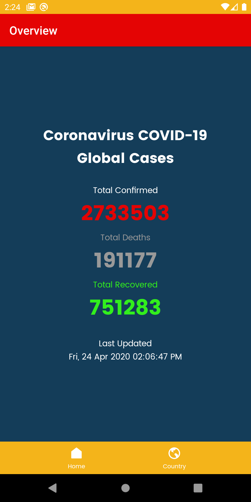
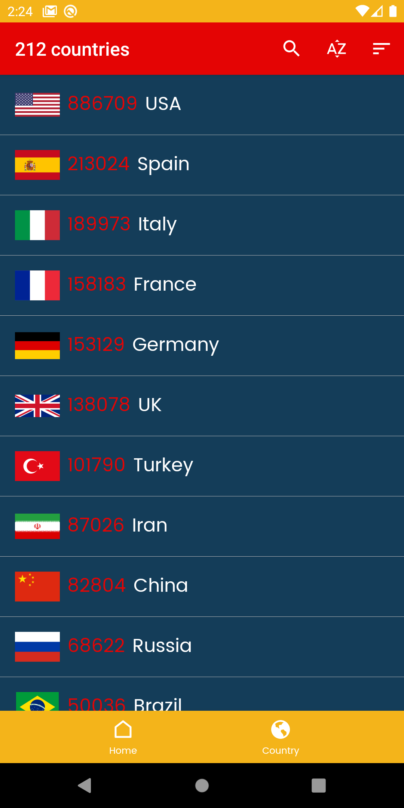

# CovidTrackerApp
App to track the cases,deaths and recovered people from all countries across the world
Coronavirus Covid-19 Tracking App Realtime Data - Volley Fetch REST API in Android Studio

# 📱 APK file Link ► https://bit.ly/TrackCovid19

Preview of the app :

Data is always updated regularly
Public JSON API obtained from :

► https://corona.lmao.ninja/v2/all 

► https://corona.lmao.ninja/v2/countries    

NovelCOVID-API Github repository for the JSON API ► https://github.com/NovelCOVID/API

